# xcms-based preprocessing of LC-MS/MS data for feature-based molecular networking with GNPS2

## Introduction

This document describes data inspection and preprocessing of an LC-MS/MS
data set using *xcms* ([Louail, Brunius, et al.
2025](#ref-louail_xcms_2025)) and export of the data for subsequent
feature-based molecular networking (FBMN) with GNPS2. Functionality from
different packages from the RforMassSpectrometry package ecosystem are
combined to visualize and process the data.

For details and more in depth description of the various visualizations
and analysis options as well as parameter choices see also the
[Metabonaut](https://rformassspectrometry.github.io/Metabonaut)
tutorials ([Louail, Graeve, et al.
2025](#ref-louail_rformassspectrometrymetabonaut_2025)).

This analysis and the used settings should be considered *initial* with
potential refinement and improvement based on discussions expected
during integration of the analysis into the FBMS workflow.

## Required software packages

The various software packages required for the analysis are defined and
loaded below. All packages are available through Bioconductor or CRAN
and can be installed with `BiocManager::install(<package name>)`.

``` r

library(MsExperiment) # container for MS data
library(Spectra)      # main MS infrastructure for R
library(xcms)         # for preprocessing of LC-MS and LC-MS/MS data
library(MsBackendMgf) # to export MS data in MGF format

library(RColorBrewer) # to define colors
library(pander)       # to format tables
library(pheatmap)     # visualization of clustering results as heatmap
library(vioplot)      # to create *violin plots*
```

## Data import

The data analyzed here is part of the MassIVE
[MSV000090156](https://massive.ucsd.edu/ProteoSAFe/dataset.jsp?task=06bd49807caa4390961fb827606a8696)
data set. The full data set (raw data files) should first downloaded
from the respective directory of the ftp server:
<ftp://massive-ftp.ucsd.edu/v04/MSV000090156/>. Here we will analyze the
data from *Lab 2*. Before loading the data we define a `data.frame` with
sample and experiment-specific information for the individual MS
runs/data files. These should ideally comprise all relevant phenotypic
but also technical information (e.g. injection index) to allow proper
adjusting or modeling of the data.

``` r

pd <- data.frame(
    file_name = c("Interlab-LC-MS_Lab2_A15M_Pos_MS2_Rep1.mzML",
                  "Interlab-LC-MS_Lab2_A15M_Pos_MS2_Rep2.mzML",
                  "Interlab-LC-MS_Lab2_A15M_Pos_MS2_Rep3.mzML",
                  "Interlab-LC-MS_Lab2_A45M_Pos_MS2_Rep1.mzML",
                  "Interlab-LC-MS_Lab2_A45M_Pos_MS2_Rep2.mzML",
                  "Interlab-LC-MS_Lab2_A45M_Pos_MS2_Rep3.mzML",
                  "Interlab-LC-MS_Lab2_A5M_Pos_MS2_Rep1.mzML",
                  "Interlab-LC-MS_Lab2_A5M_Pos_MS2_Rep2.mzML",
                  "Interlab-LC-MS_Lab2_A5M_Pos_MS2_Rep3.mzML",
                  "Interlab-LC-MS_Lab2_M_Pos_MS2_Rep1.mzML",
                  "Interlab-LC-MS_Lab2_M_Pos_MS2_Rep2.mzML",
                  "Interlab-LC-MS_Lab2_M_Pos_MS2_Rep3.mzML",
                  "Interlab-LC-MS_Lab2_PPL_Pos_MS2_Rep1.mzML"),
    sample_name = c("A15M", "A15M", "A15M",
                    "A45M", "A45M", "A45M",
                    "A5M", "A5M", "A5M",
                    "M", "M", "M",
                    "PPL"),
    sample_desc = c("A15M_R1", "A15M_R2", "A15M_R3",
                    "A45M_R1", "A45M_R2", "A45M_R3",
                    "A5M_R1", "A5M_R2", "A5M_R3",
                    "M_R1", "M_R2", "M_R3",
                    "PPL_R1"),
    replicate = c(1, 2, 3, 1, 2, 3, 1, 2, 3, 1, 2, 3, 1)
)
```

To run this analysis the MS data files (in mzML format) above need to be
available. In the example workflow, they were downloaded from the
MassIVE ftp server and stored to a local folder
*/data/massive-ftp.ucsd.edu/v04*. Below we define the path to the data
files and load the data set. This needs to be adapted if the files were
stored to a different folder.

``` r

path <- file.path("/data", "massive-ftp.ucsd.edu", "v04",
                  "MSV000090156", "peak", "mzml", "POS_MSMS",
                  "Lab_2")
mse <- readMsExperiment(file.path(path, pd$file_name),
                        sampleData = pd)
mse
```

    Object of class MsExperiment
     Spectra: MS1 (16302) MS2 (49500)
     Experiment data: 13 sample(s)
     Sample data links:
      - spectra: 13 sample(s) to 65802 element(s).

The samples and data files from the present data set are displayed in
the table below. Note that in the R code block below we use the R *pipe*
operator `|>` to avoid nested function calls and improve the readability
of the code.

``` r

sampleData(mse)[, c("sample_name", "sample_desc", "replicate")] |>
    as.data.frame() |>
    pandoc.table(style = "rmarkdown", split.table = Inf)
```

|   | sample_name | sample_desc | replicate |
|:--:|:--:|:--:|:--:|
| **Interlab-LC-MS_Lab2_A15M_Pos_MS2_Rep1.mzML** | A15M | A15M_R1 | 1 |
| **Interlab-LC-MS_Lab2_A15M_Pos_MS2_Rep2.mzML** | A15M | A15M_R2 | 2 |
| **Interlab-LC-MS_Lab2_A15M_Pos_MS2_Rep3.mzML** | A15M | A15M_R3 | 3 |
| **Interlab-LC-MS_Lab2_A45M_Pos_MS2_Rep1.mzML** | A45M | A45M_R1 | 1 |
| **Interlab-LC-MS_Lab2_A45M_Pos_MS2_Rep2.mzML** | A45M | A45M_R2 | 2 |
| **Interlab-LC-MS_Lab2_A45M_Pos_MS2_Rep3.mzML** | A45M | A45M_R3 | 3 |
| **Interlab-LC-MS_Lab2_A5M_Pos_MS2_Rep1.mzML** | A5M | A5M_R1 | 1 |
| **Interlab-LC-MS_Lab2_A5M_Pos_MS2_Rep2.mzML** | A5M | A5M_R2 | 2 |
| **Interlab-LC-MS_Lab2_A5M_Pos_MS2_Rep3.mzML** | A5M | A5M_R3 | 3 |
| **Interlab-LC-MS_Lab2_M_Pos_MS2_Rep1.mzML** | M | M_R1 | 1 |
| **Interlab-LC-MS_Lab2_M_Pos_MS2_Rep2.mzML** | M | M_R2 | 2 |
| **Interlab-LC-MS_Lab2_M_Pos_MS2_Rep3.mzML** | M | M_R3 | 3 |
| **Interlab-LC-MS_Lab2_PPL_Pos_MS2_Rep1.mzML** | PPL | PPL_R1 | 1 |

We in addition also define different colors for the individual samples.

``` r

#' Define a color for each unique original sample
col <- sampleData(mse)$sample_name |>
                     unique() |>
                     length() |>
                     brewer.pal("Set2")
names(col) <- unique(sampleData(mse)$sample_name)

#' Define a color for each data file/sample
col_sample <- col[sampleData(mse)$sample_name]
```

## Data visualization and general quality assessment

For data inspection and a general data overview we first create base
peak chromatograms (BPC) and total ion chromatograms (TIC) of the data
set using the
[`chromatograms()`](https://rdrr.io/pkg/ProtGenerics/man/protgenerics.html)
functions specifying either `"max"` (for BPC) or `"sum"` (for TIC) as
the function to aggregate the per-spectrum intensities.

``` r

#' BPC
bpc <- chromatogram(mse, aggregationFun = "max")

plot(bpc, col = paste0(col_sample, 80), main = "BPC", lwd = 2)
grid()
legend("topright", col = col, legend = names(col), lty = 1, lwd = 2)
```

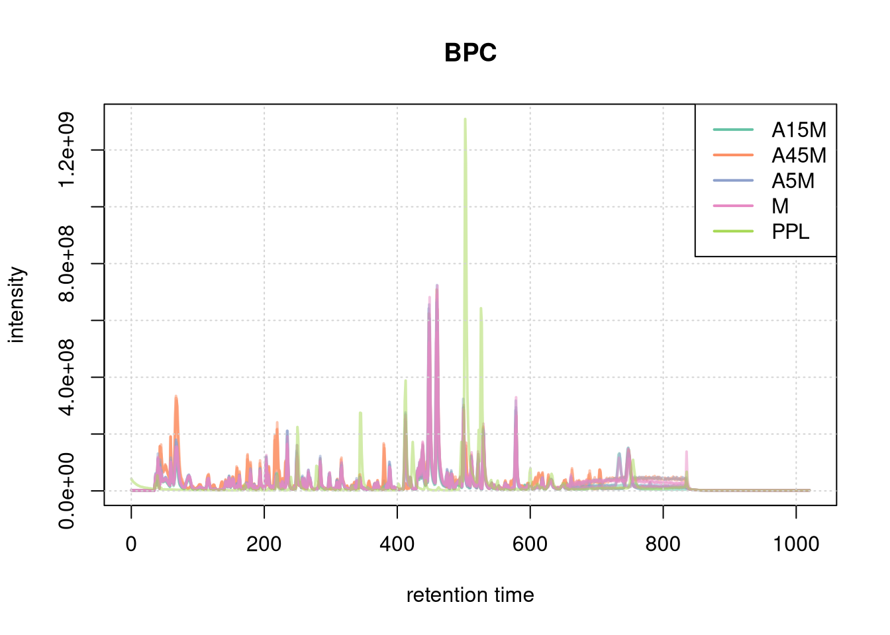

``` r

#' TIC
tic <- chromatogram(mse, aggregationFun = "sum")

plot(tic, col = paste0(col_sample, 80), main = "TIC", lwd = 2)
grid()
legend("topright", col = col, legend = names(col), lty = 1, lwd = 2)
```

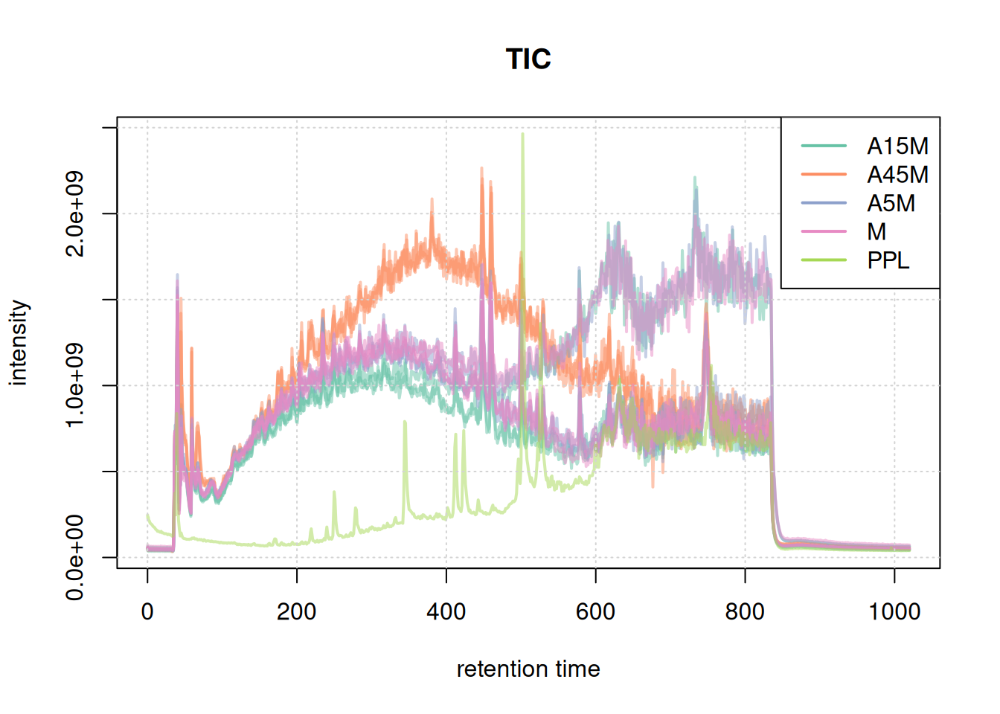

Based on the BPC and TIC there seems to be little retention time shifts
between the samples. Also, no signal seems to be present before 20
seconds and after 850 seconds. Thus, we below filter the data set to
spectra acquired within this retention time range.

``` r

#' filter the data set to a retention time range from 20 to 850 seconds
mse <- filterSpectra(mse, filterRt, c(20, 850))
```

BPC and TIC aggregate data along the *m/z* dimension per spectrum
(retention time) to compare the signal measured along the retention
time. To compare the *mass* or ion content of the individual
samples/measurement runs we in addition aggregate data along the
retention time, for distinct *m/z* values.

To this end we first bin each spectrum to get discrete and similar *m/z*
values within the data set.

``` r

#' bin mass peaks into into discrete m/z bins of 0.02 Da.
s_bin <- spectra(mse) |>
    filterMsLevel(1L) |>
    bin(binSize = 0.02)

#' combine all spectra within the same sample into a single spectrum
#' reporting the maximum intensity of all mass peaks with the same m/z bin
bps <- combineSpectra(s_bin, f = s_bin$dataOrigin, intensityFun = max)
#' the same but reporting the sum of intensities per m/z bin
tis <- combineSpectra(s_bin, f = s_bin$dataOrigin, intensityFun = sum)
```

We have thus a single aggregated mass spectrum per sample. These *base
peak spectra* are plotted below.

``` r

par(mar = c(4.5, 4, 0, 0.5))
plotSpectra(bps, main = "")
```

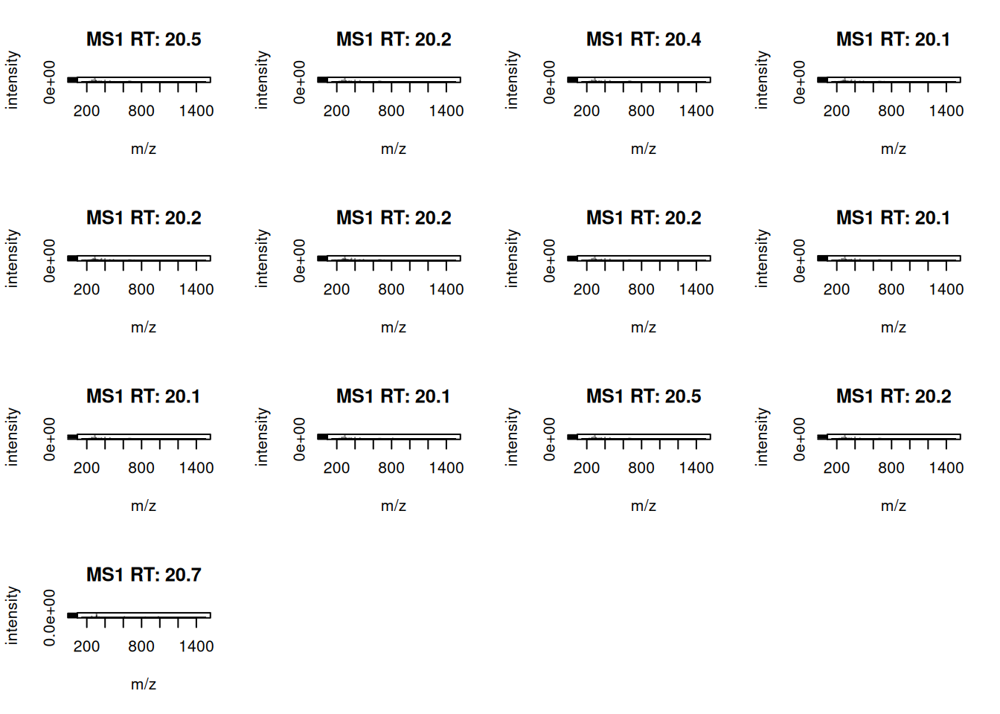

Aggregated MS1 spectrum per sample.

The *mass content* of the samples seems to be similar, with the
exception of the last file. We can also plot all spectra into the same
plot, using a different color per sample.

``` r

plotSpectraOverlay(bps, col = paste0(col_sample, 40), lwd = 2)
grid()
legend("topright", col = col, legend = names(col), lty = 1)
```

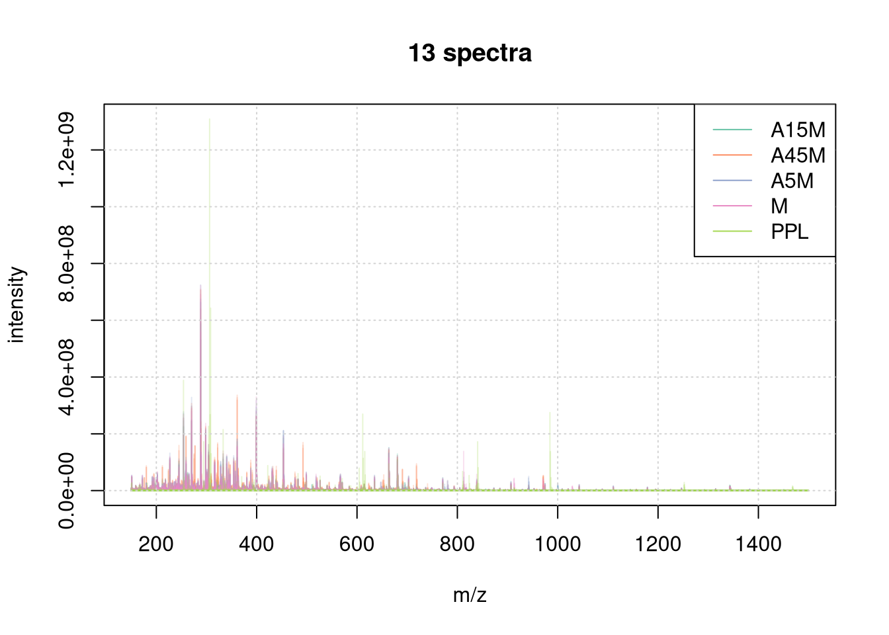

We can also use these aggregated spectra to calculate spectra similarity
between the individual samples and cluster them.

``` r

sim <- compareSpectra(bps)
rownames(sim) <- colnames(sim) <- sampleData(mse)$sample_desc
pheatmap(sim)
```

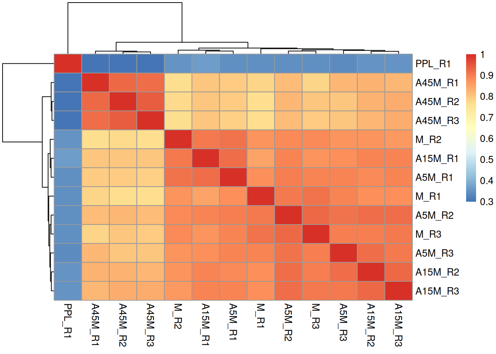

Similarity of *base peak spectra* of all samples in the experiment.

A15M, A5M and M samples cluster together, separately from the A45M
samples while the PPL_R1 sample has a distinct mass peak profile.

## Data preprocessing

Data preprocessing is the first step in the analysis of LC-MS data
processing and analyzing the raw MS data to result in a two-dimensional
quantification table of LC-MS *features* in the various samples of the
experiment. This process consists of 3 main steps: **chromatographic
peak detection**, **retention time alignment** and **correspondence
analysis**. An additional **gap-filling** step can be conducted to
reduce the number of missing values integrating raw MS signal from the
expected *m/z* by retention time areas of defined LC-MS features.

Most methods in *xcms* are parallelized by default. Below we define the
parallel processing setup for the present analysis.

> **Parallel processing details**
>
> It is generally advisable to configure the parallel processing setup
> globally using
> [`register()`](https://rdrr.io/pkg/BiocParallel/man/register.html). On
> Unix machines *multi-core* parallel processing can be used, that
> shares memory between the parallel processes. Windows supports only
> *socket-based* parallel processing and starts a separate R for each
> parallel process. Below we globally define the parallel processing
> setup depending on the operating system. For the present analysis we
> use 4 parallel processes.

``` r

if (.Platform$OS.type == "unix") {
    register(MulticoreParam(4))
} else {
    register(SnowParam(4))
}
```

### Chromatographic peak detection

The aim of the chromatographic peak detection is to identify and
quantify signal in the raw MS data space representing signal from ions
of compounds present in a sample. Data processing is performed
separately for each data file and mass peak intensities with similar
*m/z* are evaluated along retention time axis to identify
chromatographic peaks. We use the *centWave* algorithm for peak
detection. The most important parameter for *centWave* is `peakwidth`
which defines an approximate lower and upper expected width of
chromatographic peaks in retention time dimension. Without any prior
information, we need to derive this information from the data set. We
therefore zoom into areas of the BPC that seem to contain signal from an
ion.

``` r

#' extract BPC
par(mfrow = c(2, 1))
bpc <- chromatogram(mse, aggregationFun = "max")
plot(bpc, col = paste0(col_sample, 80), lwd = 2)
grid()

#' identify a retention time region to extract
rtr_1 <- c(105, 130)
abline(v = rtr_1, lty = 2)

#' identify the m/z with the largest intensity in that region:
#' - restrict to MS1 data
#' - filter the MS data by retention time
#' - extract the MS data as a data.frame
tmp <- spectra(mse) |>
    filterMsLevel(1L) |>
    filterRt(rtr_1) |>
    longForm(columns = c("mz", "intensity"))

#' define a m/z range around the m/z with largest intensity
mzr_1 <- tmp$mz[which.max(tmp$intensity)] + c(-0.005, 0.005)

#' extract an EIC for that RT and m/z region
eic_1 <- chromatogram(mse, rt = rtr_1, mz = mzr_1)
plot(eic_1, col = paste0(col_sample, 80), lwd = 2)
grid()
```

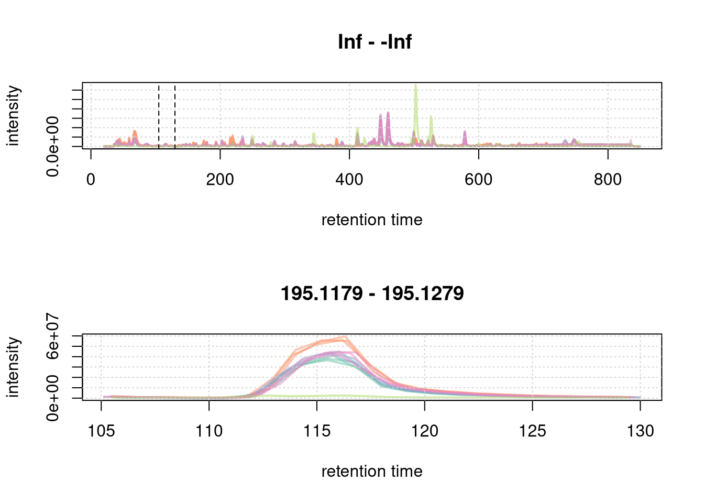

Definition of an example region for EIC extraction. Upper panel: BPC,
dashed vertical lines indicate the selected retention time region. Lower
panel: EIC for the *m/z* region with the largest signal in the retention
time window.

The width of this chromatographic peaks is about 8 seconds. We evaluate
a second signal at the and of the chromatogram.

``` r

par(mfrow = c(2, 1))
plot(bpc, col = paste0(col_sample, 80), lwd = 2)
grid()

#' identify a region to extract
rtr_2 <- c(720, 770)
abline(v = rtr_2, lty = 2)

#' identify the m/z with the largest intensity in that region:
#' - restrict to MS1 data
#' - filter the MS data by retention time
#' - extract the MS data as a data.frame
tmp <- spectra(mse) |>
    filterMsLevel(1L) |>
    filterRt(rtr_2) |>
    longForm(columns = c("mz", "intensity"))

#' define a m/z range around the m/z with largest intensity
mzr_2 <- tmp$mz[which.max(tmp$intensity)] + c(-0.005, 0.005)

#' extract an EIC for that RT and m/z region
eic_2 <- chromatogram(mse, rt = rtr_2, mz = mzr_2)
plot(eic_2, col = paste0(col_sample, 80), lwd = 2)
grid()
```

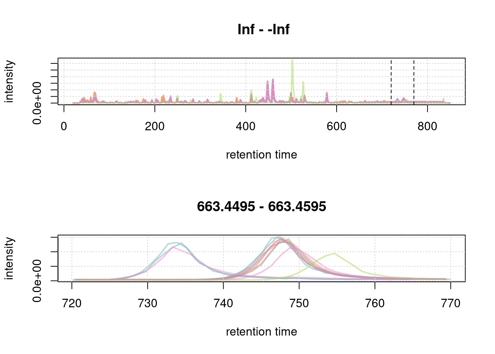

Definition of an example region for EIC extraction. Upper panel: BPC,
dashed vertical lines indicate the selected retention time region. Lower
panel: EIC for the *m/z* region with the largest signal in the retention
time window.

The width of the chromatographic peaks for that *m/z* slice seem to be
around 15 seconds. Also, there seems to be a considerable shift in
retention times between the samples.

Based on these two example signals we define the `peakdwidth` parameter
for the present data set to be between and 5 and 20 seconds. For a
*real* data analysis it is suggested to evaluate more signals, also
eventually of internal standards or ions of compounds that are expected
to be present in the sample.

A second potentially data set-specific parameter of the *centWave*
algorithm is `ppm`. It defines the maximum allowed deviation in *m/z*
dimension of mass peaks in consecutive spectra considered to represent
signal from the same ion. To illustrate this we below subset the full MS
data from the first data file to the *m/z* and retention time range
defined above and plot the individual mass peaks.

> **Details on the `ppm` *centWave* parameter**
>
> The `ppm` parameter defines the expected (or observed) *m/z* deviation
> of mass peaks representing signal from the same compound/ion in
> consecutive spectra. This scattering of mass peak’s *m/z* values can
> depend on the centroiding algorithm used or the precision of the MS
> instrument. In addition, on TOF instruments, the scattering can depend
> on the intensity of the signal, with higher variation observed for low
> intensity peaks and increasing stability with higher signal.

``` r

mse[1L] |>
    filterSpectra(filterMsLevel, 1L) |>
    filterSpectra(filterRt, rt = rtr_1) |>
    filterSpectra(filterMzRange, mz = mzr_1) |>
    plot()
```

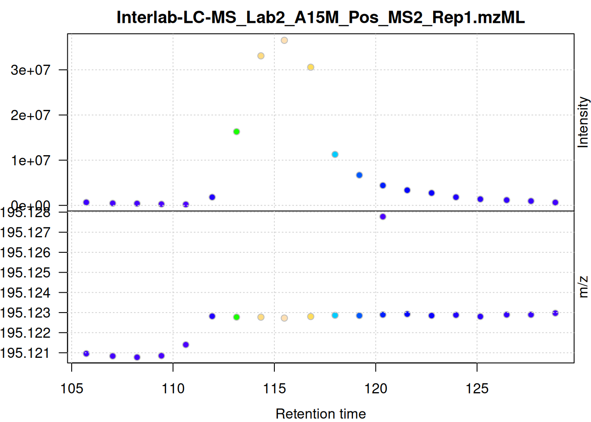

The individual mass peaks are shown in the lower panel in the plot
above. For the present ion, the *m/z* values show a very low variance.

We evaluate the signal also for the second *m/z* - retention time window
defined above.

``` r

mse[1L] |>
    filterSpectra(filterMsLevel, 1L) |>
    filterSpectra(filterRt, rt = rtr_2) |>
    filterSpectra(filterMzRange, mz = mzr_2) |>
    plot()
```

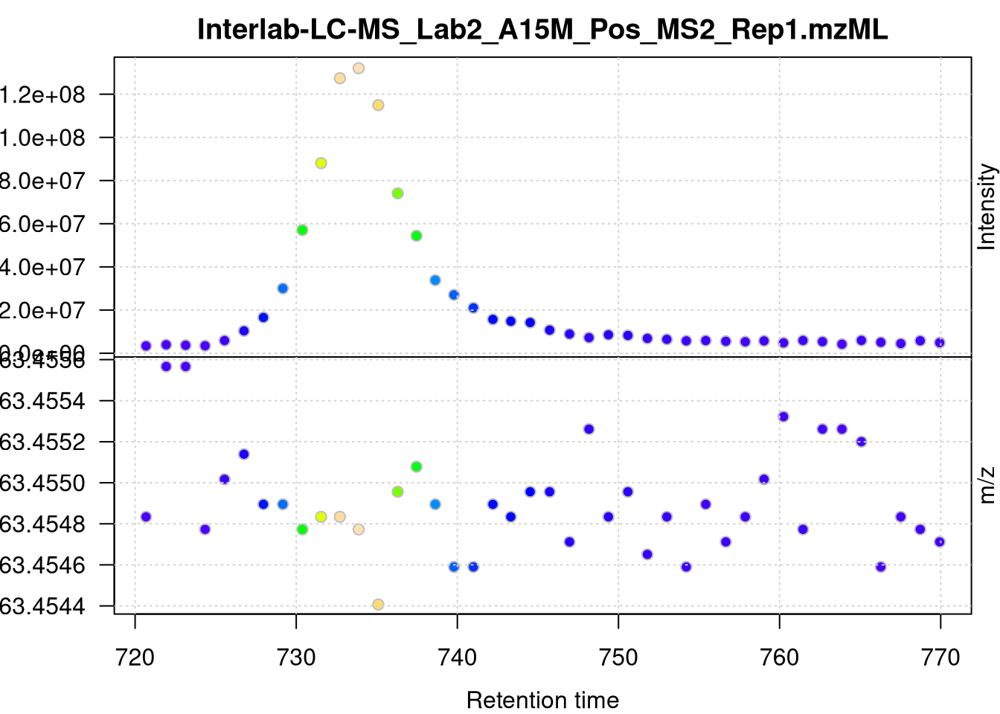

The scattering of *m/z* values looks larger, but is still below 0.001
Da. We nevertheless use a `ppm = 20` for the present data set - as we do
not assume that ions from different compounds elute at the same time
with a difference in ppm lower than 20.

Below we define the settings for *centWave* and perform the
chromatographic peak detection on the full data set. Note that it can
also be helpful to test the different settings by performing peak
detection on extracted ion chromatograms as described in
[Metabonaut](https://rformassspectrometry.github.io/Metabonaut/).
Parameter `chunkSize` defines the number of data files from which MS
data should be loaded at a time. This parameter thus has an influence on
the memory usage of the analysis.

``` r

#' configure and perform chromatographic peak detection
cwp <- CentWaveParam(
    ppm = 20,
    peakwidth = c(5, 20),
    snthresh = 8,
    integrate = 2,
    mzdiff = 0.001
)
mse <- findChromPeaks(mse, param = cwp, chunkSize = 4L)
```

In most cases it is also advisable to perform a *peak postprocessing* to
remove artifacts of the *centWave* peak detection (e.g. overlapping or
split peaks). Below we perform such peak refinement which will merge
partially or completely overlapping chromatographic peak, or those that
are less than 2 seconds apart from each other, if the intensity below
both apexes is lower than a certain proportion of the apex intensity of
the lower intensity peak.

``` r

#' configure and perform *peak refinement*
mnpp <- MergeNeighboringPeaksParam(
    expandRt = 1,
    expandMz = 0,
    ppm = 0,
    minProp = 0.75)
mse <- refineChromPeaks(mse, mnpp, chunkSize = 4L)
```

We next compare the number of identified peaks per sample as well as
their *m/z* and retention time widths.

``` r

#' split the detected chrom peaks per sample
pk_list <- split.data.frame(
    chromPeaks(mse, columns = c("mzmin", "mzmax", "rtmin", "rtmax")),
    chromPeaks(mse, columns = "sample")[, "sample"])
#' calculate mz and rt widths
pk_list <- lapply(pk_list, function(z) {
    cbind(z, mz_width = z[, "mzmax"] - z[, "mzmin"],
          mz_width_ppm = (z[, "mzmax"] - z[, "mzmin"]) * 1e6 / z[, "mzmax"],
          rt_width = z[, "rtmax"] - z[, "rtmin"])
})

#' plot the information
par(mfrow = c(3, 1), mar = c(0, 4.3, 1.5, 0.1))
barplot(unlist(lapply(pk_list, nrow)),
     col = col_sample,
     ylab = "peak count", main = "Peak detection summary, mse", xaxt = "n")
grid()
legend("top", horiz = TRUE, col = col, pch = 15,
       legend = names(col))
par(mar = c(0, 4.3, 0, 0.1))
vioplot(lapply(pk_list, function(z) z[, "mz_width_ppm"]), outline = FALSE,
        ylab = "m/z width [ppm]", xaxt = "n", line = 3,
        col = col_sample)
grid()
vioplot(lapply(pk_list, function(z) z[, "rt_width"]),
        ylab = "rt width [s]", col = col_sample, line = 3)
grid()
```

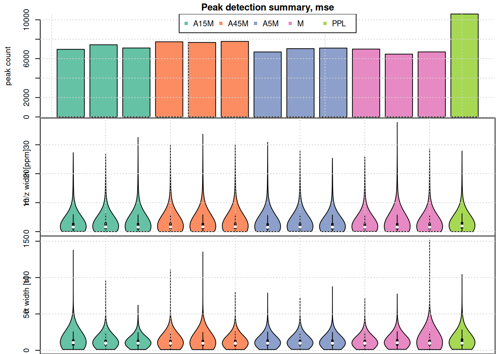

The highest number of peaks was detected in the *PPL* sample. Apart from
that sample, the numbers of detected peaks is comparable in the data
set. Also the *m/z* width and the retention time widths. As expected,
most of the identified chromatographic peaks are about 10 seconds wide.
Also, their *m/z* width is below 10 ppm for most peaks, but some show
also a larger *m/z* widths.

We also evaluate the peak detection results on the two example *m/z* -
retention time regions. Identified chromatographic peaks will be colored
according to the sample group.

``` r

eic_1 <- chromatogram(mse, mz = mzr_1, rt = rtr_1)

#' define a color for each chromatographic peak
col_peak <- col_sample[chromPeaks(eic_1)[, "sample"]]
plot(eic_1, col = paste0(col_sample, 80),
     peakBg = paste0(col_peak, 10),
     peakCol = paste0(col_peak, 80))
grid()
legend("topright", col = col, lty = 1,
       legend = names(col))
```

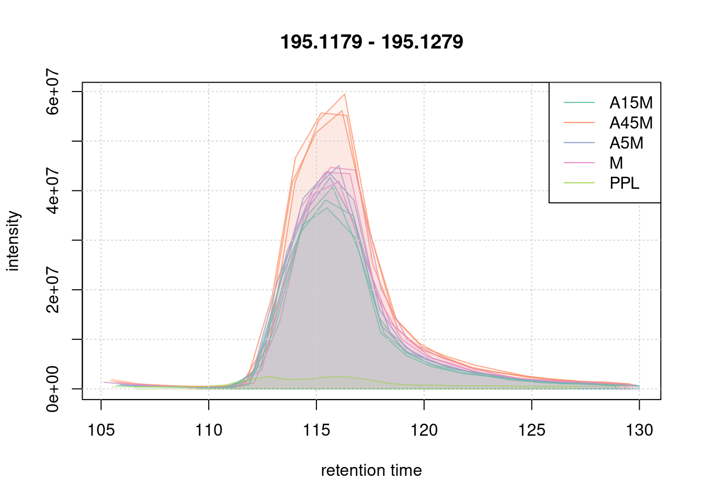

Chromatographic peak detection results on the first example EIC.

``` r

eic_2 <- chromatogram(mse, mz = mzr_2, rt = rtr_2)

#' define a color for each chromatographic peak
col_peak <- col_sample[chromPeaks(eic_2)[, "sample"]]
plot(eic_2, col = paste0(col_sample, 80),
     peakBg = paste0(col_peak, 10),
     peakCol = paste0(col_peak, 80))
grid()
legend("topright", col = col, lty = 1,
       legend = names(col))
```

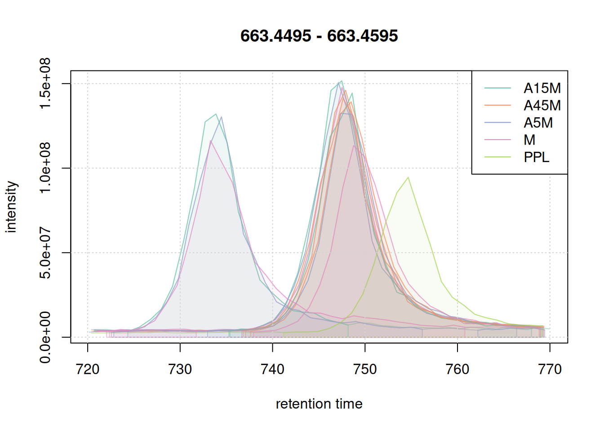

Chromatographic peak detection results on the second example EIC.

### Retention time alignment

The aim of the retention time alignment step is to reduce differences
observed in the elution time of compounds between different LC-MS runs.
A variety of methods for this have been proposed and some are also
implemented in *xcms*. We use the most straight forward approach that
aligns chromatographic runs based on retention times of *anchor peaks*,
i.e., compounds present in most of the samples of an experiment. To
define these anchor peaks we must however perform an initial
correspondence analysis and group chromatographic peaks with similar
*m/z* and retention time across samples.

We use the *peak density* correspondence method which groups
chromatographic peaks into an LC-MS feature, if their *m/z* difference
is smaller than `binSize` (+ `ppm` of the *m/z*), the retention time of
their apex is within one peak of the *peak density* curve (which
smoothness can be configured with parameter `bw`) and a chromatographic
peak is present in at least `minFraction` of at least one of the sample
groups defined with `sampleGroups`. For the initial correspondence we
apply more relaxed settings and consider all samples to be in the same
sample group (since we want to define anchor peaks that are present in
most samples).

> **Details on `PeakDensityParam` settings**
>
> The *peak density* correspondence method can be configured using the
> `PeakDensityParam`. For an initial correspondence used for retention
> time alignment more relaxed settings can be used, also putting all
> samples into the same *sample group*. The important parameters are
> `bw` and `binSize`. The former defines the tolerance of retention time
> similarity, the latter the similarity of *m/z* values for
> chromatographic peaks from different samples to be considered to
> represent signal from ions of the same compound. Setting `binSize` is
> straight forward - it depends on the resolution of the instrument and
> the expected similarity of *m/z* values for the same ion. We set it to
> a value of `binSize = 0.01`, hence all chromatographic peaks with a
> difference in *m/z* smaller than 0.01 would be evaluated. The `bw`
> parameter is a bit more difficult to define. It should be defined
> based on observed data in the experiment, ideally, on EICs of closely
> eluting compounds with the same *m/z*. In our example we use the
> second example *m/z* - retention time range, because it seemed to
> contain signal from the same compound, but with quite large shifts
> between data files. We below *simulate* a correspondence analysis on
> this EIC. Other parameters defined are `minFraction`, which defines
> the minimum required proportion of samples of one of the sample groups
> defined with parameter `sampleGroups` in which a chromatographic peak
> is present, and `ppm` which, together with `binSize` defines the
> maximal accepted difference in chromatographic peaks’ *m/z* values to
> consider them for grouping.

``` r

pdp <- PeakDensityParam(
    sampleGroups = rep(1, length(mse)),
    bw = 2,
    minFraction = 0.2,
    binSize = 0.01,
    ppm = 10)

col_peak <- col_sample[chromPeaks(eic_2)[, "sample"]]
plotChromPeakDensity(eic_2, param = pdp, col = col_sample, peakCol = col_peak,
                     peakBg = paste0(col_peak, 40))
grid()
```


Correspondence analysis simulation on the second example EIC.

The upper panel of this plot shows the EIC, the lower panel the data
considered for correspondence: it shows the retention time of the apex
positions of all chromatographic peaks in that *m/z* slice on the x-axis
against the sample in which the chromatographic peak was detected on the
y-axis. The black solid line represents the *peak density estimate*,
calculated based on the retention times of the chromatographic peaks and
parameter `bw` with larger values of `bw` resulting in more smooth
curves.

With the used settings, in particular parameter `bw`, the present
chromatographic peaks would be split into two separate LC-MS features
(indicated with a grey rectangle in the lower panel). Assuming that all
peaks in that region represent signal from ions of the same compound, we
however want to group them into the same feature. We hence next increase
the `bw` parameter and simulate the correspondence with these updated
settings.

``` r

pdp@bw <- 5
plotChromPeakDensity(eic_2, param = pdp, col = col_sample, peakCol = col_peak,
                     peakBg = paste0(col_peak, 40))
grid()
```

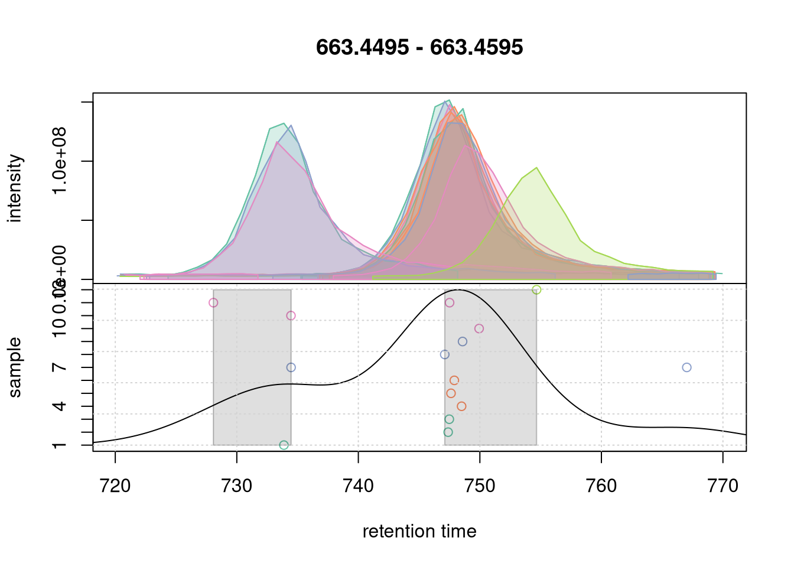

Correspondence analysis simulation with `bw = 5`.

Changing `bw` to 5 changed the density curve, but we still defined two
separate features. We thus increase below `bw` to 7.

``` r

pdp@bw <- 7
plotChromPeakDensity(eic_2, param = pdp, col = col_sample, peakCol = col_peak,
                     peakBg = paste0(col_peak, 40))
grid()
```

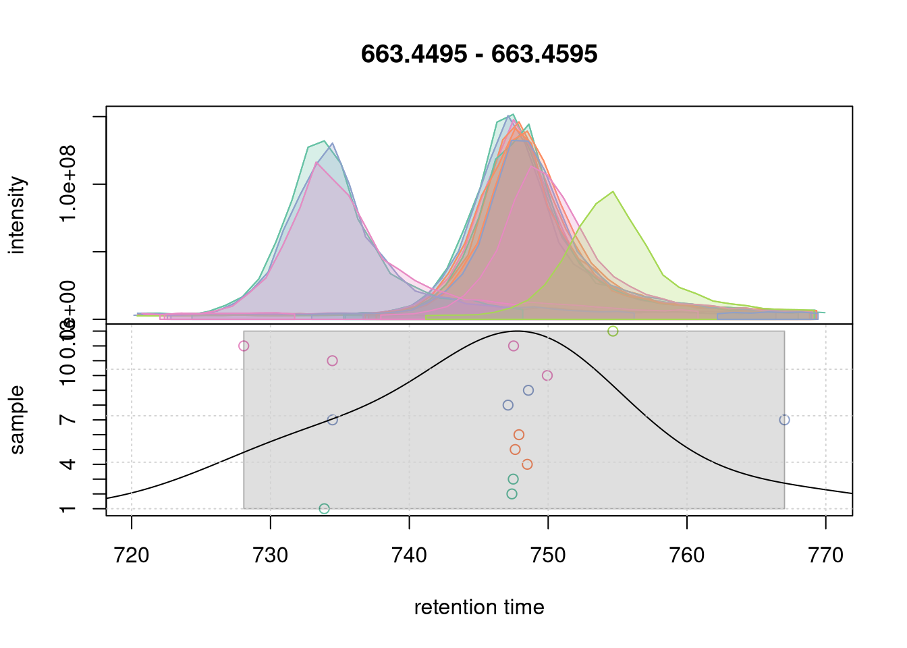

Correspondence analysis simulation with `bw = 7`.

With a `bw = 7` a single feature was defined. We use these parameter for
the initial correspondence analysis on the full data set.

``` r

#' perform initial correspondence analysis to group chromatographic peaks
mse <- groupChromPeaks(mse, param = pdp)
```

For the retention time alignment we use the before mentioned *peak
groups* method that aligns LC runs by minimizing retention time
differences of so called anchor peaks. This alignment method is very
robust and also flexible, allowing for example to align samples based on
within-experiment QC samples, or against external reference data or
based on manually defined anchor peaks. See
[Metabonaut](https://rformassspectrometry.github.io/Metabonaut) for
examples and options. The method can be configured with
[`PeakGroupsParam()`](https://rdrr.io/pkg/xcms/man/adjustRtime.html).
With `minFraction = 0.9` we below define anchor peaks as those LC-MS
features (defined by the initial correspondence analysis) for which a
chromatographic peak was identified in 90% of the samples of the whole
experiment. The observed retention time differences of these are used to
model a curve along retention time dimension which is then used to align
the retention times of all samples. The smoothness of this curve can be
configured with parameter `span` (values between 0 and 1; values around
0.5 work in most cases).

``` r

#' configure and run retention time alignment
pgp <- PeakGroupsParam(
    minFraction = 0.90,
    span = 0.4)
mse <- adjustRtime(mse, param = pgp)
```

The effect of this alignment can be visualized with the
[`plotAdjustedRtime()`](https://rdrr.io/pkg/xcms/man/plotAdjustedRtime.html)
function. It plots the adjusted retention times of each sample on the
x-axis against the difference between the adjusted and raw retention
times on the y-axis as a solid line. Retention times of anchor peaks in
each sample are indicated with individual data points. These should
ideally be placed along the full retention time range of the experiment.

``` r

#' visualize alignment results
plotAdjustedRtime(mse, col = paste0(col_sample, 80),
                  peakGroupsPch = 21, lwd = 2)
grid()
legend("topleft", col = col, lty = 1,
       legend = names(col))
```

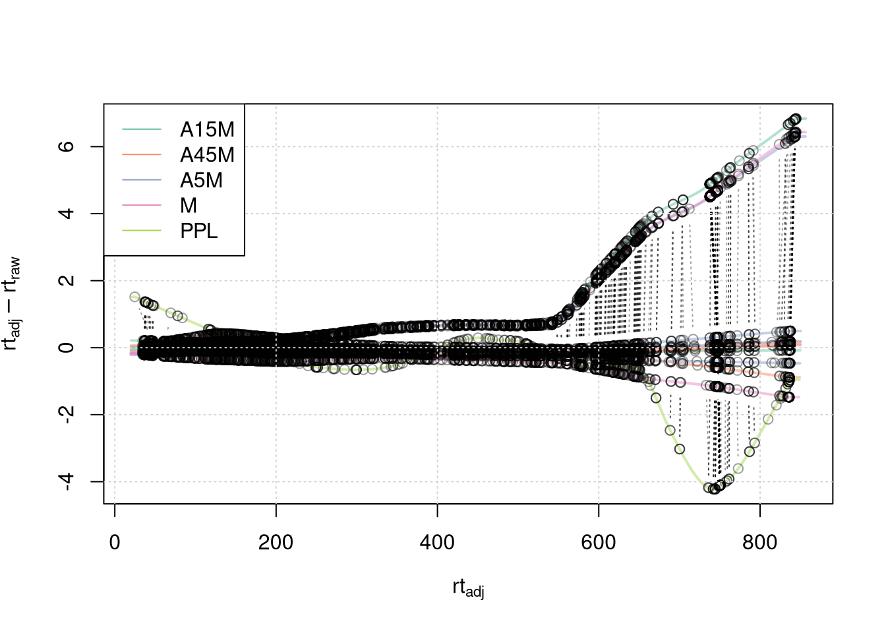

Retention time alignment results.

Anchor points span the full retention time range. Retention time
adjustments for most samples were below 2-4 seconds, with the exception
of 3 samples for which a considerably larger adjustment is present after
500 seconds, and the PPL sample with larger retention time differences
after 650 seconds.

We next evaluate the alignment results based on the BPC before and after
alignment.

``` r

#' create a BPC after adjustment; chromPeaks = "none" only creates the BPC
#' without extracting also identified chromatographic peaks.
bpc_adj <- chromatogram(mse, chromPeaks = "none", aggregationFun = "max")

par(mfrow = c(2, 1))
plot(bpc, col = paste0(col_sample, 80), main = "BPC, raw", lwd = 2)
grid()
legend("topright", col = col, legend = names(col), lty = 1, lwd = 2)
plot(bpc_adj, col = paste0(col_sample, 80), main = "BPC, adjusted", lwd = 2)
grid()
```

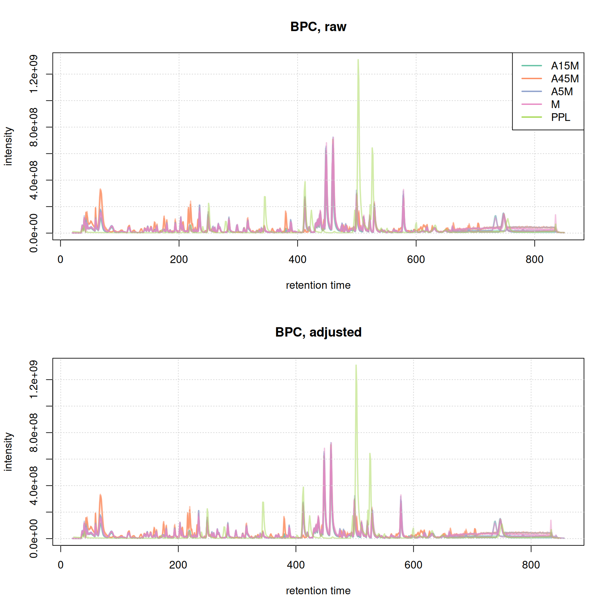

BPC before (top) and after (bottom) retention time alignment.

Misalignment of signal at the later stage of the chromatography seems to
be reduced. We in addition evaluate the effect of retention time
alignment on the two example EICs.

``` r

eic_1_adj <- chromatogram(mse, rt = rtr_1, mz = mzr_1, chromPeaks = "none")

par(mfrow = c(2, 1))
plot(eic_1, col = paste0(col_sample, 80), lwd = 2, peakType = "none")
grid()
legend("topright", col = col, legend = names(col), lty = 1, lwd = 2)
plot(eic_1_adj, col = paste0(col_sample, 80), lwd = 2)
grid()
```

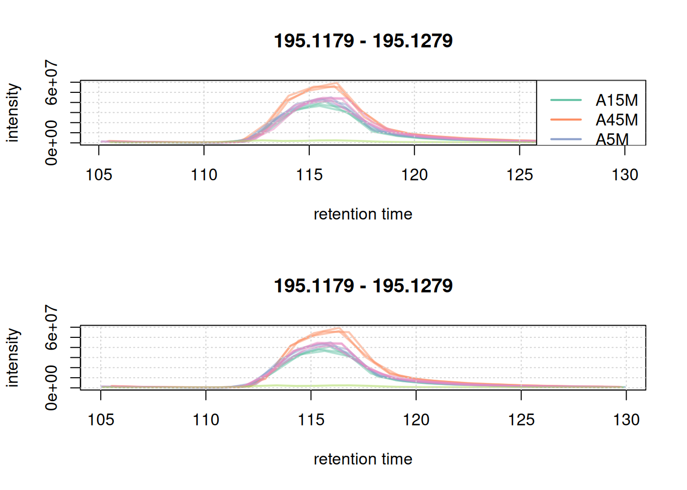

First example EIC before (top) and after (bottom) retention time
alignment.

For this early retention time range already the raw signal was well
aligned.

``` r

eic_2_adj <- chromatogram(mse, rt = rtr_2, mz = mzr_2, chromPeaks = "none")

par(mfrow = c(2, 1))
plot(eic_2, col = paste0(col_sample, 80), lwd = 2, peakType = "none")
grid()
legend("topright", col = col, legend = names(col), lty = 1, lwd = 2)
plot(eic_2_adj, col = paste0(col_sample, 80), lwd = 2)
grid()
```


Second example EIC before (top) and after (bottom) retention time
alignment.

This later retention time range shows clear, and strong, differences in
retention times of 4 samples. While the *PPL* sample could be aligned
quite well using the above settings, 3 samples still show considerable
shifts in retention times. We thus re-perform the alignment reducing the
value for the `span` parameter to switch to a more *local* alignment of
the samples. We below first *undo* the retention time alignment,
re-perform the initial correspondence analysis and perform the alignment
with the changed settings for parameter `span`.

``` r

#' remove retention time alignment results
mse <- dropAdjustedRtime(mse)
#' re-perform initial correspondence
mse <- groupChromPeaks(mse, param = pdp)
#' perform the alignment using updated settings
pgp <- PeakGroupsParam(
    minFraction = 0.90,
    span = 0.1)
mse <- adjustRtime(mse, param = pgp)
```

Evaluating the impact of changing this parameter.

``` r

#' visualize alignment results
plotAdjustedRtime(mse, col = paste0(col_sample, 80),
                  peakGroupsPch = 21, lwd = 2)
grid()
legend("topleft", col = col, lty = 1,
       legend = names(col))
```


Retention time alignment results.

A stronger alignment can be observed for the retention time area from
750 to 800 seconds. The results for the first example EIC did not
change.

``` r

eic_1_adj <- chromatogram(mse, rt = rtr_1, mz = mzr_1)

par(mfrow = c(2, 1))
#' Setting peakType = "none" prevents identified chromatographic peaks to be
#' indicated in the plot.
plot(eic_1, col = paste0(col_sample, 80), lwd = 2, peakType = "none")
grid()
legend("topright", col = col, legend = names(col), lty = 1, lwd = 2)
plot(eic_1_adj, col = paste0(col_sample, 80), lwd = 2, peakType = "none")
grid()
```

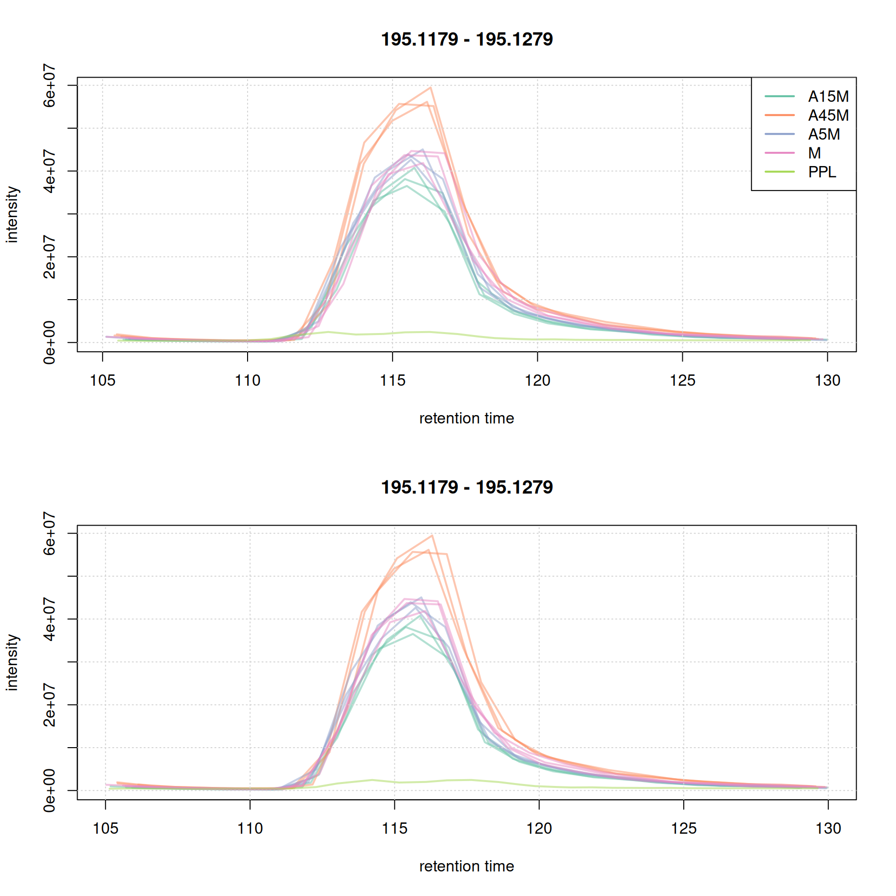

First example EIC before (top) and after (bottom) retention time
alignment.

While for the second EIC the alignment improved.

``` r

eic_2_adj <- chromatogram(mse, rt = rtr_2, mz = mzr_2)

par(mfrow = c(2, 1))
plot(eic_2, col = paste0(col_sample, 80), lwd = 2, peakType = "none")
grid()
legend("topright", col = col, legend = names(col), lty = 1, lwd = 2)
plot(eic_2_adj, col = paste0(col_sample, 80), lwd = 2, peakType = "none")
grid()
```


Second example EIC before (top) and after (bottom) retention time
alignment.

Note that in most cases it is not necessary that all samples are
perfectly aligned. Some variation in retention time can be accounted for
in the final correspondence analysis.

### Correspondence analysis

The correspondence analysis groups chromatographic peaks from different
samples, all assumed to represent signal from ions of the same compound,
into LC-MS features. Signals are generally grouped together based on
similarity of their *m/z* and retention times. We use the *peak density*
method and, similarly to what we did in the previous section, we first
evaluate the impact of different parameter settings on the expected
results. Also, for the final correspondence we use the samples’
*sample_name* for parameter `sampleGroup`. Combined with setting
`minFraction = 0.67`, an LC-MS feature is defined if a chromatographic
peak is present in at least 67% of the replicates per sample (i.e., 2
out of 3).

``` r

#' configure the *peak density* correspondence method
pdp <- PeakDensityParam(
    sampleGroups = sampleData(mse)$sample_name,
    minFraction = 0.67,
    binSize = 0.01,
    ppm = 10,
    bw = 7)
```

We evaluate these settings, in particular the effect of `bw` on the
first example EIC.

``` r

col_peak <- col_sample[chromPeaks(eic_1_adj)[, "sample"]]
plotChromPeakDensity(eic_1_adj, param = pdp, col = col_sample,
                     peakCol = col_peak, peakBg = paste0(col_peak, 40))
grid()
```


Simulation of correspondence analysis on the first example EIC.

For that EIC the settings worked nicely. Simulating the correspondence
for the second example EIC.

``` r

col_peak <- col_sample[chromPeaks(eic_2_adj)[, "sample"]]
plotChromPeakDensity(eic_2_adj, param = pdp, col = col_sample,
                     peakCol = col_peak, peakBg = paste0(col_peak, 40))
grid()
```

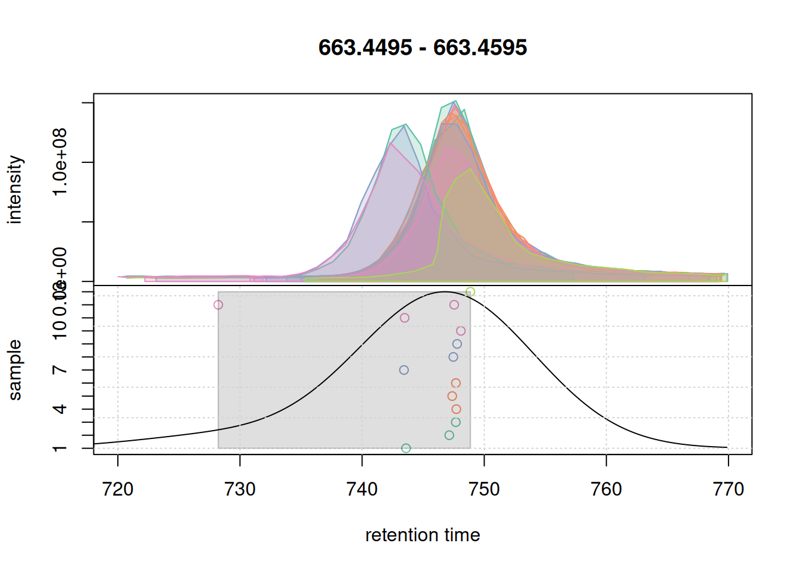

Simulation of correspondence analysis on the second example EIC.

Also for the second EIC all chromatographic peaks got grouped into the
same feature. Ideally, correspondence parameters should also be
simulated on more complex signals, e.g. regions with co- or closely
eluting compounds. We below expand the retention time window for the
*m/z* slice of the first example EIC.

``` r

a <- chromatogram(mse, mz = mzr_1, rt = c(30, 150))

col_peak <- col_sample[chromPeaks(a)[, "sample"]]
plotChromPeakDensity(a, param = pdp, col = col_sample,
                     peakCol = col_peak, peakBg = paste0(col_peak, 40))
grid()
```

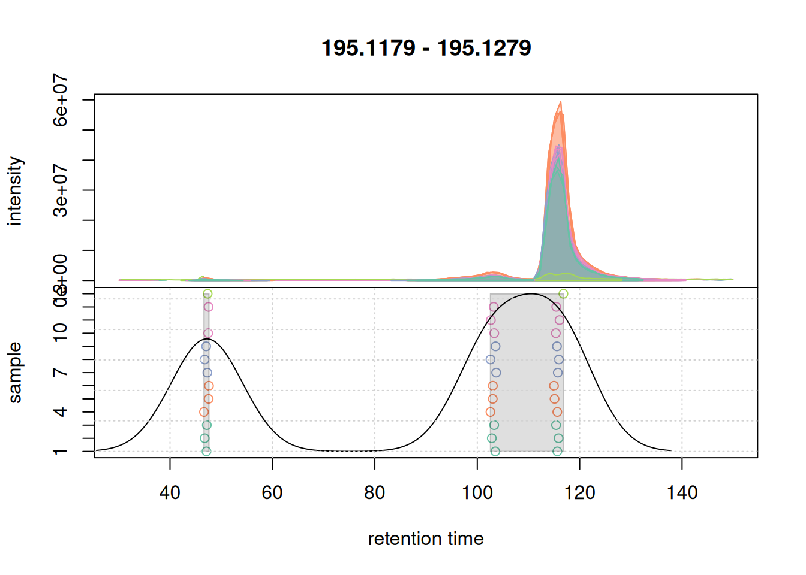

Simulation of correspondence analysis on an expanded RT window.

There seem to be signal from 3 different compounds in that *m/z* slice.
Using the settings above, in particular with `bw = 7` the apparently
different chromatographic signals at about 105 and 115 seconds are
grouped into the same LC-MS feature as indicated with the grey rectangle
in the plot above. Unless we want that these signals are grouped
together, we need to reduce the value of `bw`. Below we simulate a
correspondence using `bw = 3`.

``` r

pdp@bw <- 3
plotChromPeakDensity(a, param = pdp, col = col_sample,
                     peakCol = col_peak, peakBg = paste0(col_peak, 40))
grid()
```

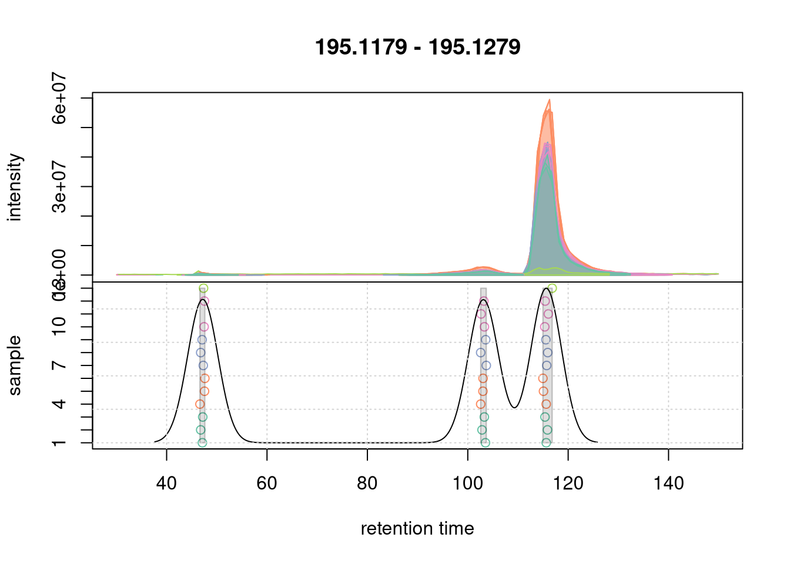

Effect of changing to `bw = 3` for the correspondence analysis.

With `bw = 3` we successfully grouped the signals into 3 distinct
features. We next evaluate whether with these updated setting we would
still group the signal from the second example EIC into a single
feature.

``` r

col_peak <- col_sample[chromPeaks(eic_2_adj)[, "sample"]]
plotChromPeakDensity(eic_2_adj, param = pdp, col = col_sample,
                     peakCol = col_peak, peakBg = paste0(col_peak, 40))
grid()
```


Effect of `bw = 3` on correspondence results of the second example EIC.

All chromatographic peaks for this region were grouped into a single
region. We thus proceed and use these settings for the correspondence
analysis of the full data set.

``` r

#' perform correspondence analysis on the full data set
mse <- groupChromPeaks(mse, param = pdp)
```

It is advised to check the results again after correspondence analysis,
also to evaluate the impact of the other settings like `binSize` and
`ppm` and assure validity of the defined LC-MS features. Ideally, a
larger number of EICs/features should be checked. We below extract the
first example EIC again and evaluate the correspondence results for it.
Here it is important to set `simulate = FALSE` to show the actual
results.

``` r

eic_1 <- chromatogram(mse, rt = rtr_1, mz = mzr_1)

#' plot the actual correspondence results by setting `simulate = FALSE`
col_peak <- col_sample[chromPeaks(eic_1)[, "sample"]]
plotChromPeakDensity(eic_1, col = col_sample, peakCol = col_peak,
                     peakBg = paste0(col_peak, 40),
                     simulate = FALSE)
grid()
```

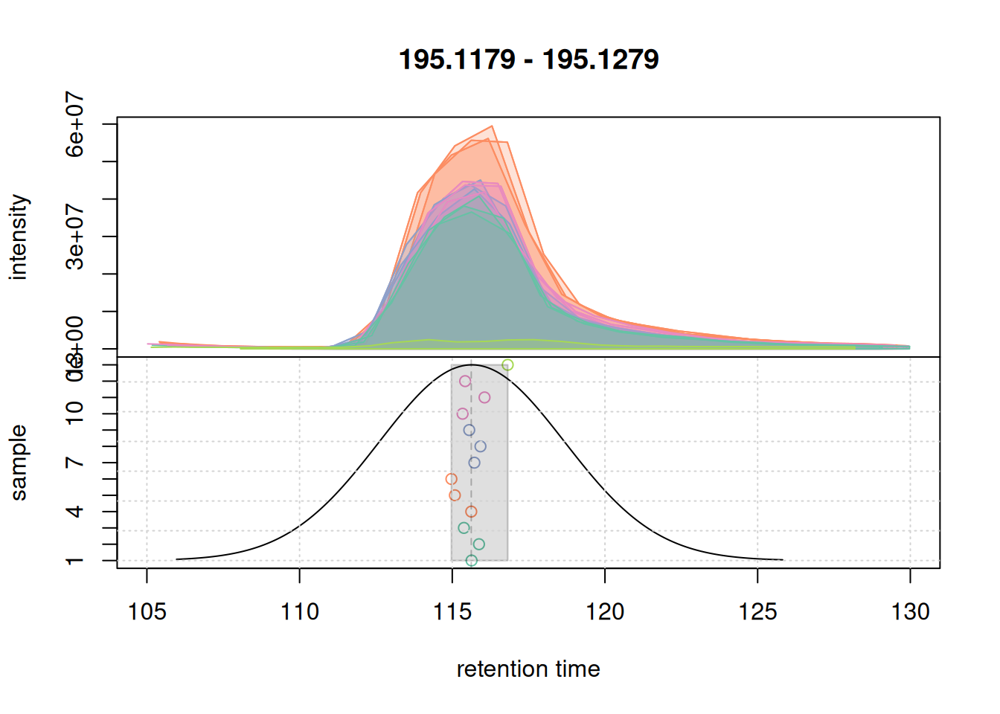

Correspondence results for the first example EIC.

All chromatographic peaks were grouped into the same feature. The
retention time (`"rtmed"`) of the feature is indicated with a dashed
vertical line. We next evaluate the results also on the second example
EIC.

``` r

eic_2 <- chromatogram(mse, rt = rtr_2, mz = mzr_2)

#' plot the actual correspondence results by setting `simulate = FALSE`
col_peak <- col_sample[chromPeaks(eic_2)[, "sample"]]
plotChromPeakDensity(eic_2, col = col_sample, peakCol = col_peak,
                     peakBg = paste0(col_peak, 40),
                     simulate = FALSE)
grid()
```

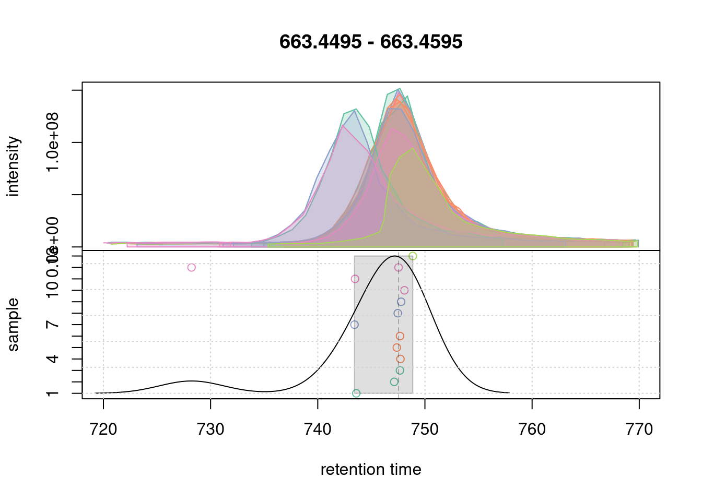

Correspondence results for the second example EIC.

Also for this retention time region, chromatographic peaks were grouped
into a single feature. At last we evaluate the expanded retention time
region of the *m/z* range of the first example EIC.

``` r

a <- chromatogram(mse, mz = mzr_1, rt = c(30, 150))

col_peak <- col_sample[chromPeaks(a)[, "sample"]]
plotChromPeakDensity(a, col = col_sample, peakCol = col_peak,
                     peakBg = paste0(col_peak, 40),
                     simulate = FALSE)
grid()
```


Correspondence results for an *m/z* slice with multiple closely eluting
compounds.

For this region, chromatographic peaks were grouped into 3 distinct
features.

The results from the correspondence analysis can be extracted from the
result object using the
[`featureDefinitions()`](https://rdrr.io/pkg/xcms/man/XCMSnExp-class.html)
and
[`featureValues()`](https://rdrr.io/pkg/xcms/man/XCMSnExp-peak-grouping-results.html)
functions. The former returns the *definition* of the LC-MS features,
i.e., their *m/z* and retention time, the latter the actual abundance
estimates in the different samples. We below count the number of
features that were defined by the correspondence analysis:

``` r

featureDefinitions(mse) |>
    nrow()
```

    [1] 14808

A quite large number of features was defined. This is mostly due to the
setting for the `minFraction` parameter, which required a
chromatographic peak to be detected in only 2 out of the 3 replicates
for each individual sample to define, and combine them into, a feature.

We can now extract the abundance estimates of all features with the
[`featureValues()`](https://rdrr.io/pkg/xcms/man/XCMSnExp-peak-grouping-results.html)
function. Below we extract this data matrix and assign the unique sample
name as column names (by default the MS data file name is used).

``` r

fvals <- featureValues(mse, method = "sum")
colnames(fvals) <- sampleData(mse)$sample_desc
head(fvals)
```

            A15M_R1 A15M_R2 A15M_R3  A45M_R1 A45M_R2 A45M_R3  A5M_R1 A5M_R2 A5M_R3
    FT00001      NA      NA      NA       NA      NA      NA      NA     NA     NA
    FT00002      NA      NA      NA       NA      NA      NA      NA     NA     NA
    FT00003      NA      NA      NA       NA      NA      NA      NA     NA     NA
    FT00004      NA 3392535      NA 10258668      NA 9478585 5519297     NA     NA
    FT00005      NA      NA      NA  9521460      NA 6722026 2419544     NA     NA
    FT00006      NA      NA      NA  4874998      NA 5897690 3338828     NA     NA
               M_R1 M_R2 M_R3    PPL_R1
    FT00001      NA   NA   NA  127518.4
    FT00002      NA   NA   NA  201678.3
    FT00003      NA   NA   NA  502676.9
    FT00004 3684237   NA   NA 6198111.3
    FT00005 3405333   NA   NA 2953772.8
    FT00006      NA   NA   NA 6931111.8

Columns in this abundance matrix are samples, rows features. For the
present data set there are a large number of missing values. A missing
value indicates failure to detect a chromatographic peak for the *m/z* -
retention time region of a feature in a sample. This can have multiple
reasons: the compound might simply not be present in the sample or the
original signal is too noisy, to low in abundance, or does not fit the
expected shape for the peak detection algorithm to identify a
chromatographic peak.

Below we calculate and plot the number of missing values per sample.

``` r

#' determine the number of missing values per sample and plot them
nas <- apply(fvals, MARGIN = 2, function(z) sum(is.na(z)))

barplot(nas, main = "Number of missing values", col = col_sample)
```

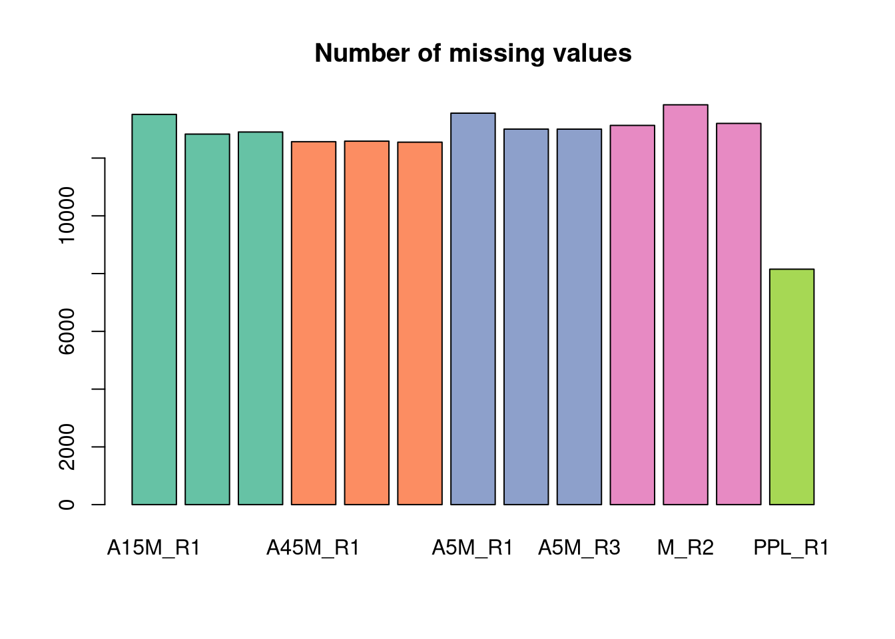

Number of missing feature values per sample.

The lowest number of missing values is present in the *PPL_R1* sample.

### Gap-filling

To reduce the number of missing values and avoid data imputation we
perform *gap-filling*: in samples with a missing value for a feature
(i.e., in which no chromatographic peak was detected) we integrate all
intensities measured within the *m/z* - retention time area of the
feature. By default, this area is defined as the 25% to 75% quantile of
the lower, respectively upper *m/z* (and retention time) boundary of all
chromatographic peaks of a feature. As an example we calculate this area
with the
[`featureArea()`](https://rdrr.io/pkg/xcms/man/XcmsExperiment.html)
function for the first 6 features:

``` r

featureArea(mse,
            mzmin = function(z) quantile(z, probs = 0.25, na.rm = TRUE),
            mzmax = function(z) quantile(z, probs = 0.75, na.rm = TRUE),
            rtmin = function(z) quantile(z, probs = 0.25, na.rm = TRUE),
            rtmax = function(z) quantile(z, probs = 0.75, na.rm = TRUE),
            features = rownames(featureDefinitions(mse))[1:4])
```

               mzmin    mzmax    rtmin    rtmax
    FT00001 150.0268 150.0270 588.3672 594.2322
    FT00002 150.0789 150.0791 166.7511 175.2998
    FT00003 150.0912 150.0916 245.4199 254.4996
    FT00004 150.1022 150.1030 812.2422 837.7419

Thus, for gap-filling, missing values are replaced with the integrated
signal measured by the MS instrument within these *m/z* - retention time
boundaries.

We below perform the gap-filling on the full data set.

``` r

#' configure and perform gap-filling
cpap <- ChromPeakAreaParam(minMzWidthPpm = 10)
mse <- fillChromPeaks(mse, param = cpap, chunkSize = 4L)
```

We extract the feature values again and determine the number of missing
values.

``` r

fvals <- featureValues(mse, method = "sum")
colnames(fvals) <- sampleData(mse)$sample_desc
head(fvals)
```

              A15M_R1   A15M_R2    A15M_R3  A45M_R1   A45M_R2   A45M_R3    A5M_R1
    FT00001        NA        NA         NA       NA        NA        NA        NA
    FT00002        NA        NA         NA       NA        NA        NA        NA
    FT00003  725629.5  395193.8   609652.6   709672  712048.4  325696.1  582689.3
    FT00004 6667479.8 3392535.0 10874295.1 10258668 9681633.2 9478584.9 5519297.2
    FT00005 4424076.9 5594730.1  8961144.0  9521460 7483711.7 6722025.8 2419544.4
    FT00006 5058937.4 6075048.7  8164059.6  4874998 7531471.2 5897690.0 3338828.4
                A5M_R2  A5M_R3      M_R1    M_R2      M_R3    PPL_R1
    FT00001         NA      NA   56655.1      NA        NA  127518.4
    FT00002         NA      NA        NA      NA        NA  201678.3
    FT00003   737115.2  653138  470292.9  357432  463980.4  502676.9
    FT00004 10336613.6 6591140 3684237.3 6720029 8384267.6 6198111.3
    FT00005 10403154.3 5371937 3405332.8 5232400 8119441.8 2953772.8
    FT00006  7827918.6 6753662 5360799.4 4505007 7968544.6 6931111.8

``` r

#' determine the number of missing values per sample and plot them
nas <- apply(fvals, MARGIN = 2, function(z) sum(is.na(z)))

barplot(nas, main = "Number of missing values", col = col_sample)
```

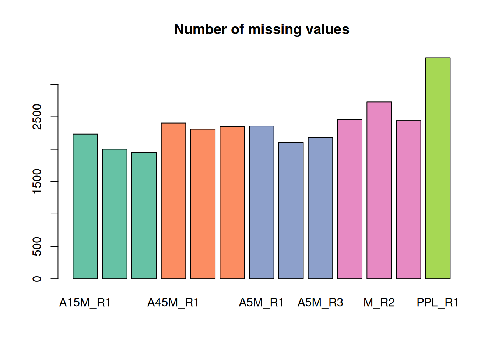

Number of missing feature values per sample after gap-filling.

A considerable amount of values could thus be *rescued*.

## Extract fragment spectra for LC-MS features

After preprocessing, we next identify and extract the MS2 spectra for
the defined LC-MS features. We use the
[`featureSpectra()`](https://rdrr.io/pkg/xcms/man/featureSpectra.html)
method, that identifies for each of the features’ chromatographic peaks
MS2 spectra (within the same sample!) with their retention time and
precursor *m/z* within the retention time and *m/z* range of the
chromatographic peak.

``` r

#' identify MS2 spectra for features
ms2 <- featureSpectra(mse)
ms2
```

    MSn data (Spectra) with 21917 spectra in a MsBackendMzR backend:
            msLevel     rtime scanIndex
          <integer> <numeric> <integer>
    1             2   169.361       834
    2             2   169.909       837
    3             2   170.225       844
    4             2   169.786       845
    5             2   169.721       844
    ...         ...       ...       ...
    21913         2   748.486      3747
    21914         2   747.600      3748
    21915         2   744.174      3679
    21916         2   748.223      3744
    21917         2   749.801      3791
     ... 40 more variables/columns.

    file(s):
    Interlab-LC-MS_Lab2_A15M_Pos_MS2_Rep2.mzML
    Interlab-LC-MS_Lab2_A15M_Pos_MS2_Rep3.mzML
    Interlab-LC-MS_Lab2_A45M_Pos_MS2_Rep1.mzML
     ... 10 more files
    Processing:
     Filter: select retention time [20..850] on MS level(s)  [Tue Dec  2 12:42:35 2025]
     Filter: select MS level(s) 2 [Tue Dec  2 12:48:30 2025]
     Filter: select MS level(s) 2 [Tue Dec  2 12:48:31 2025]
     ...2 more processings. Use 'processingLog' to list all. 

We can have multiple, or no, MS2 spectra per feature:

``` r

#' count the number of MS2 spectra per feature
ms2_count <- table(ms2$feature_id)

#' the number of LC-MS features with at least one MS2 spectrum:
length(ms2_count)
```

    [1] 3091

``` r

#' the average number of MS2 spectra per feature:
mean(ms2_count)
```

    [1] 7.090586

We next inspect some of the identified MS2 spectra.

``` r

#' select MS2 spectra for the first feature
a <- ms2[ms2$feature_id == ms2$feature_id[1]]

#' plot the spectra
plotSpectra(a)
```

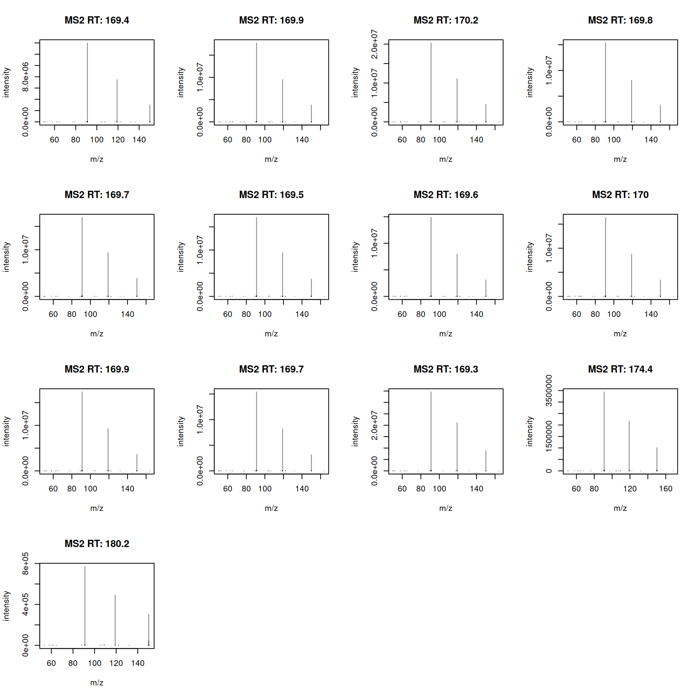

MS2 spectra for one LC-MS feature.

All MS2 spectra look similar - we next calculate also a pairwise
similarity between them and visualize the results as a heatmap.

``` r

#' calculate dot product similarity
sim <- compareSpectra(a, ppm = 10, tolerance = 0)

pheatmap(sim)
```

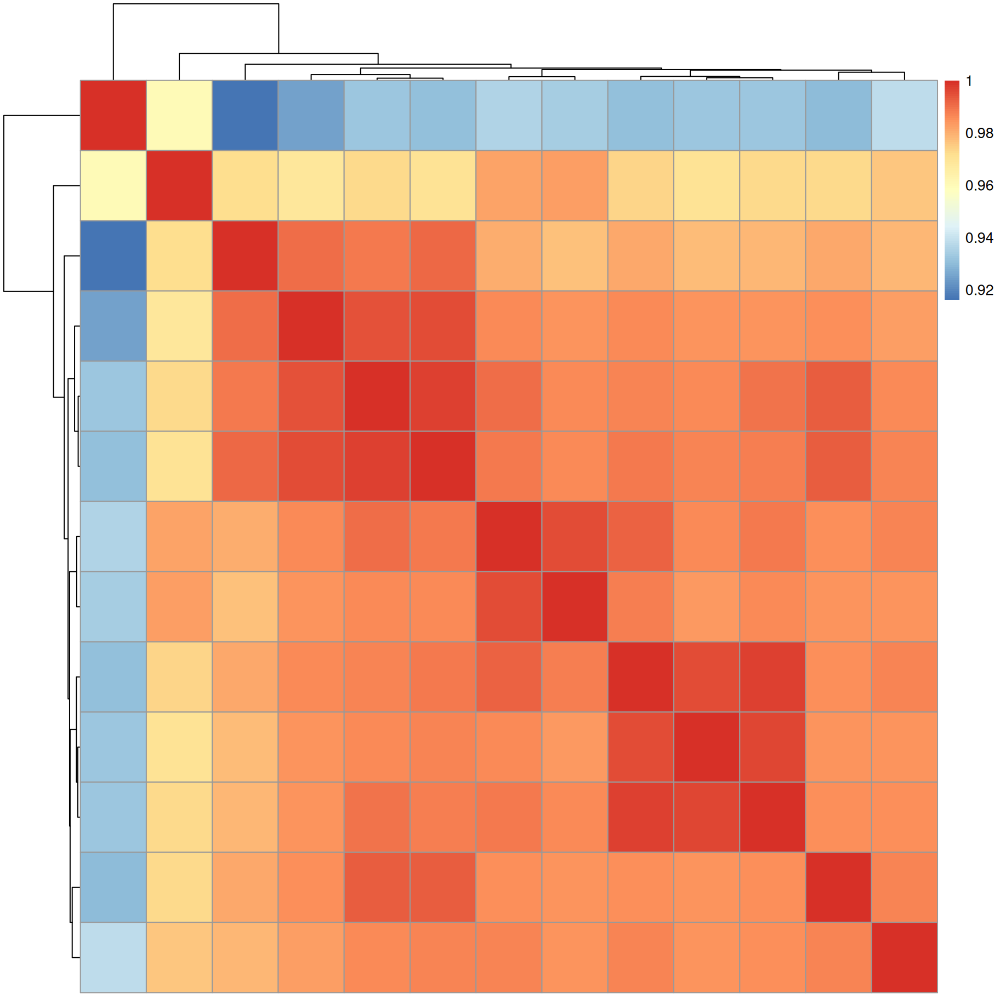

Pairwise spectra similarity between MS2 spectra of one feature.

Similarity between all MS2 spectra is very high (above 0.92).

We next combine the individual MS2 spectra of a feature to a single
*consensus* spectrum.

> **Options to combine spectra**
>
> Multiple spectra can be combined into a single spectrum using the
> [`combineSpectra()`](https://rdrr.io/pkg/Spectra/man/combineSpectra.html)
> function which provides a large number of options and parameters for
> this task, including the possibility to provide a custom function to
> combine the fragment peaks. By default (with parameter
> `peaks = "union"`), the combined spectrum contains **all** mass peaks
> of all input spectra. The option `peaks = "intersect"` allows to
> retain only peaks that are present in a certain proportion of input
> spectra. Parameters `ppm` and `tolerance` define the required
> similarity in the peaks’ *m/z* value to be considered *the same*. The
> groups of spectra to be combined are specified with parameter `f` and
> a potential splitting of the input `Spectra` object for parallel
> processing with parameter `p`.

As an example, we combine MS2 spectra keeping only mass peaks present in
at least 75% of input spectra.

``` r

#' define consensus spectra per feature
ms2_cons <- combineSpectra(ms2, f = ms2$feature_id,
                           p = rep(1, length(ms2)),
                           peaks = "intersect",
                           ppm = 10, minProp = 0.75)
ms2_cons
```

    MSn data (Spectra) with 3091 spectra in a MsBackendMemory backend:
           msLevel     rtime scanIndex
         <integer> <numeric> <integer>
    1            2  169.3607       834
    2            2  147.8949       725
    3            2   35.3421       164
    4            2  836.9768      4221
    5            2  310.3339      1548
    ...        ...       ...       ...
    3087         2   610.293      3053
    3088         2   608.046      3050
    3089         2   794.229      3958
    3090         2   744.275      3673
    3091         2   749.801      3791
     ... 40 more variables/columns.
    Processing:
     Filter: select retention time [20..850] on MS level(s)  [Tue Dec  2 12:42:35 2025]
     Filter: select MS level(s) 2 [Tue Dec  2 12:48:30 2025]
     Filter: select MS level(s) 2 [Tue Dec  2 12:48:31 2025]
     ...3 more processings. Use 'processingLog' to list all. 

We have thus now one consensus spectrum per feature. A summary of the
numbers of peaks per consensus spectrum is shown below.

``` r

#' overview on the number of peaks per spectrum
quantile(lengths(ms2_cons))
```

       0%   25%   50%   75%  100%
      1.0  66.5 102.0 146.0 463.0 

The consensus spectrum for the first feature is shown below.

``` r

plotSpectra(ms2_cons[1], lwd = 2)
grid()
```

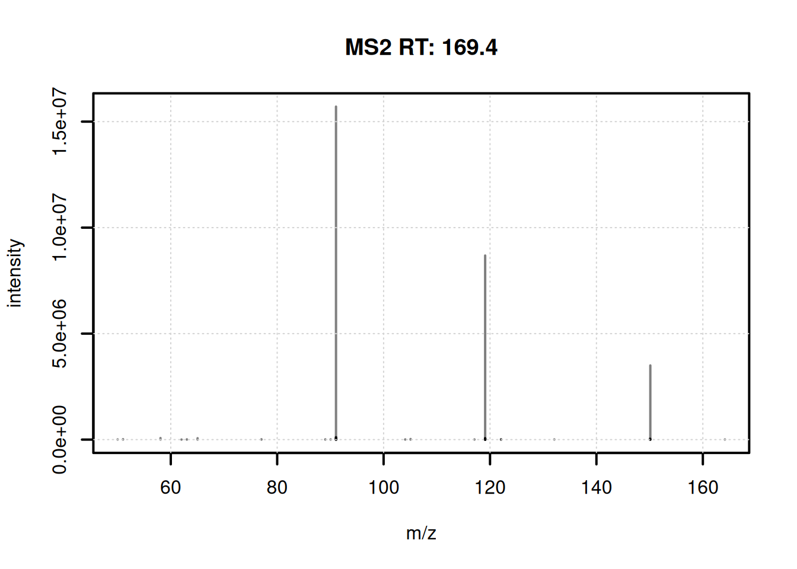

Consensus spectrum for the first feature.

We next filter the data and remove spectra with a single fragment peak.

``` r

#' remove spectra with a single fragment peak
ms2_cons <- ms2_cons[lengths(ms2_cons) > 1]
ms2_cons
```

    MSn data (Spectra) with 3089 spectra in a MsBackendMemory backend:
           msLevel     rtime scanIndex
         <integer> <numeric> <integer>
    1            2  169.3607       834
    2            2  147.8949       725
    3            2   35.3421       164
    4            2  836.9768      4221
    5            2  310.3339      1548
    ...        ...       ...       ...
    3085         2   610.293      3053
    3086         2   608.046      3050
    3087         2   794.229      3958
    3088         2   744.275      3673
    3089         2   749.801      3791
     ... 40 more variables/columns.
    Processing:
     Filter: select retention time [20..850] on MS level(s)  [Tue Dec  2 12:42:35 2025]
     Filter: select MS level(s) 2 [Tue Dec  2 12:48:30 2025]
     Filter: select MS level(s) 2 [Tue Dec  2 12:48:31 2025]
     ...3 more processings. Use 'processingLog' to list all. 

> **Additional spectra processing options**
>
> The [*Spectra*](https://bioconductor.org/packages/Spectra) package
> would provide many additional functions and options to process, scale
> or clean spectra. As an alternative, through the
> [*SpectriPy*](https://bioconductor.org/packages/SpectriPy) package, it
> would also be possible to apply Python-based functionality from
> e.g. the *matchms* Python library to `Spectra` objects.

At last we visualize the select data (i.e. features with associated MS2
spectra) in the *m/z* - retention time space. We use the
[`featureArea()`](https://rdrr.io/pkg/xcms/man/XcmsExperiment.html)
function to get the feature boundaries and draw them as rectangles. The
associated MS2 spectra (their precursor *m/z* and retention time value)
are added as individual data points.

``` r

#' define the feature boundaries
fa <- featureArea(mse, features = ms2_cons$feature_id)

#' plot feature areas as rectangles
plot(NA, NA, xlim = range(fa[, c("rtmin", "rtmax")]),
     ylim = range(fa[, c("mzmin", "mzmax")]),
     xlab = "retention time", ylab = "m/z")
grid()
rect(xleft = fa[, "rtmin"], xright = fa[, "rtmax"],
     ybottom = fa[, "mzmin"], ytop = fa[, "mzmax"],
     border = "#00000080")
#' add precursor m/z and retention times of MS2
points(ms2_cons$rtime, ms2_cons$precursorMz,
       cex = 0.5, col = "#0000ff40")
```

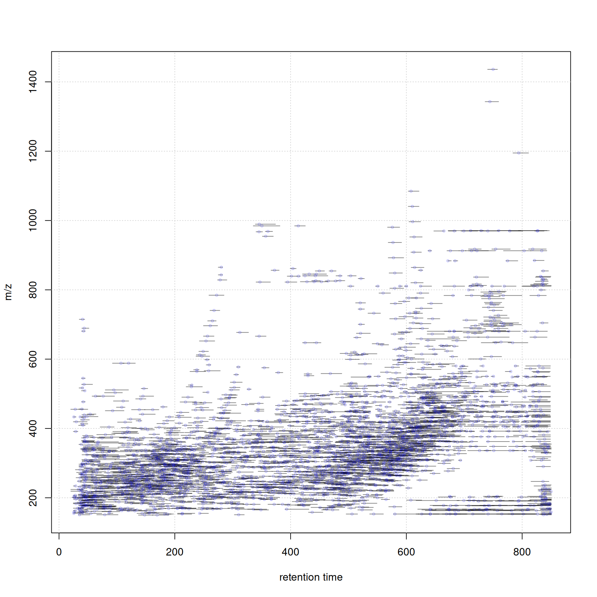

Feature areas (grey rectangles) and associated MS2 spectra (blue points)
in the retention time - *m/z* space.

Thus, with a little bit of R coding we can easily create customized data
visualizations.

## Formatting and exporting data for FBMS

We next export the feature abundance matrix and the fragment spectra for
feature-based molecular networking with GNPS. Similar to the original
workflow ([Rainer and Louail 2025](#ref-johannes_rainer_2025_17293665))
described in ([Nothias et al. 2020](#ref-nothias_feature-based_2020)) we
write the feature matrix to a tabulator delimited text file and the
associated MS2 spectra to a file in Mascot Generic File (MGF) format. A
future version of the workflow might use the mzTab-M format for the data
exchange.

We first compile the feature abundance matrix and export that to a txt
file.

``` r

#' get feature definitions
fdef <- featureDefinitions(mse)[, c("mzmed", "mzmin", "mzmax",
                                    "rtmed", "rtmin", "rtmax")]
#' combine with the feature value table
fvals <- cbind(Row.names = rownames(fdef), fdef, fvals)

#' restrict the feature abundance matrix to features with MS2 spectra
fvals <- fvals[ms2_cons$feature_id, ]

#' export the data
write.table(fvals, "xcms_ms2_features.txt", sep = "\t",
            quote = FALSE, row.names = FALSE)
```

We next reformat the information in the MS2 spectra restricting to data
required by GNPS. The respective functionality is at present provided in
the [xcms-gnps-tools](https://github.com/jorainer/xcms-gnps-tools)
GitHub repo.

``` r

#' load functions for GNPS-specific spectra formatting
source("https://raw.githubusercontent.com/jorainer/xcms-gnps-tools/master/customFunctions.R")
ms2_cons <- formatSpectraForGNPS(ms2_cons)
```

And finally we export the MS2 spectra in MGF format.

``` r

#' export the MS2 spectra in MGF format
export(ms2_cons, backend = MsBackendMgf(),
       file = "xcms_ms2_spectra.mgf")
```

> **Spectra data export formats**
>
> The MGF format is only loosely defined with many different *dialects*
> being used. The
> [*MsBackendMgf*](https://bioconductor.org/packages/MsBackendMgf)
> package supports renaming or specifying spectra variables (metadata)
> for export to the MGF format. In addition, it would also allow to
> export also additional peak information, such as chemical formulas for
> individual fragments. As an alternative, also other export formats
> would be supported for `Spectra` objects, provided by packages such as
> the [*MsBackendMsp*](https://bioconductor.org/packages/MsBackendMsp)
> or
> [*MsBackendMassbank*](https://bioconductor.org/packages/MsBackendMassbank).
> Upcoming formats, such as *specLib*, *mzPeak* or the updated mzTab-M
> format will be supported in future.

## Summary

- R-based data analysis workflows allow data set specific, tailored,
  analysis of LC-MS data.
- The *xcms* R package for LC-MS data preprocessing is tightly
  integrated into a broader ecosystem of R packages.
- The quarto system would also allow combining R and Python
  functionality into the same workflow document with the
  [SpectriPy](https://github.com/RforMassSpectrometry/SpectriPy)
  R-package translating between R and Python MS data structures.

## Session information

The R version and package versions used:

``` r

sessionInfo()
```

    R version 4.5.2 (2025-10-31)
    Platform: x86_64-pc-linux-gnu
    Running under: Ubuntu 24.04.3 LTS

    Matrix products: default
    BLAS:   /usr/lib/x86_64-linux-gnu/openblas-pthread/libblas.so.3
    LAPACK: /usr/lib/x86_64-linux-gnu/openblas-pthread/libopenblasp-r0.3.26.so;  LAPACK version 3.12.0

    locale:
     [1] LC_CTYPE=en_US.UTF-8       LC_NUMERIC=C
     [3] LC_TIME=en_US.UTF-8        LC_COLLATE=en_US.UTF-8
     [5] LC_MONETARY=en_US.UTF-8    LC_MESSAGES=en_US.UTF-8
     [7] LC_PAPER=en_US.UTF-8       LC_NAME=C
     [9] LC_ADDRESS=C               LC_TELEPHONE=C
    [11] LC_MEASUREMENT=en_US.UTF-8 LC_IDENTIFICATION=C

    time zone: Etc/UTC
    tzcode source: system (glibc)

    attached base packages:
    [1] stats4    stats     graphics  grDevices utils     datasets  methods
    [8] base

    other attached packages:
     [1] vioplot_0.5.1       zoo_1.8-14          sm_2.2-6.0
     [4] pheatmap_1.0.13     pander_0.6.6        RColorBrewer_1.1-3
     [7] MsBackendMgf_1.18.0 xcms_4.8.0          Spectra_1.20.0
    [10] BiocParallel_1.44.0 S4Vectors_0.48.0    BiocGenerics_0.56.0
    [13] generics_0.1.4      MsExperiment_1.12.0 ProtGenerics_1.42.0

    loaded via a namespace (and not attached):
     [1] DBI_1.2.3                   rlang_1.1.6
     [3] magrittr_2.0.4              clue_0.3-66
     [5] MassSpecWavelet_1.76.0      matrixStats_1.5.0
     [7] compiler_4.5.2              vctrs_0.6.5
     [9] reshape2_1.4.5              stringr_1.6.0
    [11] pkgconfig_2.0.3             MetaboCoreUtils_1.18.1
    [13] crayon_1.5.3                fastmap_1.2.0
    [15] XVector_0.50.0              rmarkdown_2.30
    [17] preprocessCore_1.72.0       purrr_1.2.0
    [19] xfun_0.54                   MultiAssayExperiment_1.36.1
    [21] jsonlite_2.0.0              progress_1.2.3
    [23] DelayedArray_0.36.0         parallel_4.5.2
    [25] prettyunits_1.2.0           cluster_2.1.8.1
    [27] R6_2.6.1                    stringi_1.8.7
    [29] limma_3.66.0                GenomicRanges_1.62.0
    [31] Rcpp_1.1.0                  Seqinfo_1.0.0
    [33] SummarizedExperiment_1.40.0 iterators_1.0.14
    [35] knitr_1.50                  IRanges_2.44.0
    [37] BiocBaseUtils_1.12.0        Matrix_1.7-4
    [39] igraph_2.2.1                tidyselect_1.2.1
    [41] abind_1.4-8                 yaml_2.3.11
    [43] doParallel_1.0.17           codetools_0.2-20
    [45] affy_1.88.0                 lattice_0.22-7
    [47] tibble_3.3.0                plyr_1.8.9
    [49] Biobase_2.70.0              S7_0.2.1
    [51] evaluate_1.0.5              pillar_1.11.1
    [53] affyio_1.80.0               BiocManager_1.30.27
    [55] MatrixGenerics_1.22.0       foreach_1.5.2
    [57] MSnbase_2.36.0              MALDIquant_1.22.3
    [59] ncdf4_1.24                  hms_1.1.4
    [61] ggplot2_4.0.1               scales_1.4.0
    [63] glue_1.8.0                  MsFeatures_1.18.0
    [65] lazyeval_0.2.2              tools_4.5.2
    [67] mzID_1.48.0                 data.table_1.17.8
    [69] QFeatures_1.20.0            vsn_3.78.0
    [71] mzR_2.44.0                  fs_1.6.6
    [73] XML_3.99-0.20               grid_4.5.2
    [75] impute_1.84.0               tidyr_1.3.1
    [77] MsCoreUtils_1.22.1          PSMatch_1.14.0
    [79] cli_3.6.5                   S4Arrays_1.10.0
    [81] dplyr_1.1.4                 AnnotationFilter_1.34.0
    [83] pcaMethods_2.2.0            gtable_0.3.6
    [85] digest_0.6.39               SparseArray_1.10.3
    [87] farver_2.1.2                htmltools_0.5.8.1
    [89] lifecycle_1.0.4             statmod_1.5.1
    [91] MASS_7.3-65                

## References

Louail, Philippine, Carl Brunius, Mar Garcia-Aloy, William Kumler,
Norman Storz, Jan Stanstrup, Hendrik Treutler, et al. 2025. “Xcms at 20
and Still in Peak Form: Anchoring a Complete Metabolomics Data
Preprocessing and Analysis Software Ecosystem.” ChemRxiv.
<https://doi.org/10.26434/chemrxiv-2025-2n2kh>.

Louail, Philippine, Marilyn De Graeve, Anna Tagliaferri, Vinicius Verri
Hernandes, Daniel Marques de Sá e Silva, and Johannes Rainer. 2025.
“Rformassspectrometry/Metabonaut: V1.2.0.” Zenodo.
<https://doi.org/10.5281/zenodo.15554287>.

Nothias, Louis-Félix, Daniel Petras, Robin Schmid, Kai Dührkop, Johannes
Rainer, Abinesh Sarvepalli, Ivan Protsyuk, et al. 2020. “Feature-Based
Molecular Networking in the GNPS Analysis Environment.” *Nature Methods*
17 (9): 905–8. <https://doi.org/10.1038/s41592-020-0933-6>.

Rainer, Johannes, and Philippine Louail. 2025.
“Jorainer/Xcms-Gnps-Large-Scale: Preprocessing of a Large LC-MS/MS Data
Set for Molecular Networking with GNPS.” Zenodo.
<https://doi.org/10.5281/zenodo.17293665>.
